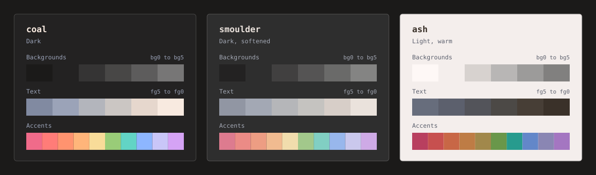

# 

A colour palette for interfaces and code, with three variants: Coal, Smoulder, and Ash.

The name comes from the changing colours of fire as it grows and reacts with different substances.

Download: [CSS](./downloads/firelight.css) or [JSON](./downloads/firelight.json)

Website: [Palette](https://ridusaini.github.io/firelight/) / [Playground](https://ridusaini.github.io/firelight/playground/) / [Community](https://ridusaini.github.io/firelight/community/)

In this README: [Variants](#variants) / [Palette](#palette) / [Suggested uses](#suggested-uses) / [Accessibility](#accessibility)

## Variants

| Variant | Appearance | Background (`bg1`) | Text (`fg1`) | Contrast |
| --- | --- | --- | --- | --- |
| `coal` | Dark | `#232222` | `#E6D7CD` | 11.31:1 |
| `smoulder` | Dark, softened | `#2E2E2E` | `#D7CEC8` | 8.76:1 |
| `ash` | Light | `#F4EEEC` | `#473E36` | 9.10:1 |

The contrast figures above compare `fg1` against `bg1`.

Each variant has 12 background and text colours, 10 accents, and three backgrounds for added, removed, and modified lines. Coal is the default for palette examples and the Playground. The website uses Smoulder.

## Numbering

Background colours run from `bg0` to `bg5`, and text colours from `fg5` to `fg0`. `bg0` is the darkest background in Coal and Smoulder, and the lightest in Ash. `fg0` has the most contrast against `bg1`.

The examples use `bg1` for backgrounds and `fg1` for body text. Any of the `fg` shades can be used for text.

CSS names include the variant, like `--fl-ash-bg1` and `--fl-coal-rose`. The JSON keeps each colour’s hex, RGB, HSL, OKLCH, and CSS names at one place.

## Palette

The 22 main colours in each variant. Contrast is measured against its `bg1` background.

<strong>Coal</strong> (dark, high contrast)

| CSS variable | Hex | Contrast |
| --- | --- | --- |
| `--fl-coal-bg0` | `#1B1A19` | 1.10:1 |
| `--fl-coal-bg1` | `#232222` | 1.00:1 |
| `--fl-coal-bg2` | `#353434` | 1.28:1 |
| `--fl-coal-bg3` | `#484746` | 1.71:1 |
| `--fl-coal-bg4` | `#5D5C5C` | 2.38:1 |
| `--fl-coal-bg5` | `#777676` | 3.50:1 |
| `--fl-coal-fg5` | `#818AA1` | 4.60:1 |
| `--fl-coal-fg4` | `#9BA3B8` | 6.29:1 |
| `--fl-coal-fg3` | `#B3B5BC` | 7.75:1 |
| `--fl-coal-fg2` | `#CBC6C3` | 9.37:1 |
| `--fl-coal-fg1` | `#E6D7CD` | 11.31:1 |
| `--fl-coal-fg0` | `#F8EAE0` | 13.48:1 |
| `--fl-coal-rose` | `#F06B8A` | 5.42:1 |
| `--fl-coal-ember` | `#FF7C78` | 6.35:1 |
| `--fl-coal-coral` | `#FF936F` | 7.30:1 |
| `--fl-coal-apricot` | `#FFB57A` | 9.18:1 |
| `--fl-coal-honey` | `#F8DC99` | 11.85:1 |
| `--fl-coal-fern` | `#99CC78` | 8.51:1 |
| `--fl-coal-verdigris` | `#62D4C5` | 8.87:1 |
| `--fl-coal-cornflower` | `#8DB6FF` | 7.76:1 |
| `--fl-coal-lilac` | `#C9C6F8` | 9.76:1 |
| `--fl-coal-orchid` | `#D5A3F5` | 7.85:1 |

<strong>Smoulder</strong> (dark, softened)

| CSS variable | Hex | Contrast |
| --- | --- | --- |
| `--fl-smoulder-bg0` | `#232222` | 1.17:1 |
| `--fl-smoulder-bg1` | `#2E2E2E` | 1.00:1 |
| `--fl-smoulder-bg2` | `#414040` | 1.31:1 |
| `--fl-smoulder-bg3` | `#555454` | 1.80:1 |
| `--fl-smoulder-bg4` | `#6A6A69` | 2.51:1 |
| `--fl-smoulder-bg5` | `#848483` | 3.63:1 |
| `--fl-smoulder-fg5` | `#9196A3` | 4.59:1 |
| `--fl-smoulder-fg4` | `#A3A8B4` | 5.70:1 |
| `--fl-smoulder-fg3` | `#B5B6B9` | 6.70:1 |
| `--fl-smoulder-fg2` | `#C5C3C0` | 7.72:1 |
| `--fl-smoulder-fg1` | `#D7CEC8` | 8.76:1 |
| `--fl-smoulder-fg0` | `#EAE2DC` | 10.61:1 |
| `--fl-smoulder-rose` | `#DD7B8F` | 4.72:1 |
| `--fl-smoulder-ember` | `#EB8B86` | 5.54:1 |
| `--fl-smoulder-coral` | `#ED9D83` | 6.31:1 |
| `--fl-smoulder-apricot` | `#F1BB90` | 7.92:1 |
| `--fl-smoulder-honey` | `#F1DDAD` | 10.14:1 |
| `--fl-smoulder-fern` | `#A2C88B` | 7.22:1 |
| `--fl-smoulder-verdigris` | `#81CFC3` | 7.53:1 |
| `--fl-smoulder-cornflower` | `#98B7EC` | 6.67:1 |
| `--fl-smoulder-lilac` | `#CAC8ED` | 8.40:1 |
| `--fl-smoulder-orchid` | `#CEAAE6` | 6.80:1 |

<strong>Ash</strong> (light, warm)

| CSS variable | Hex | Contrast |
| --- | --- | --- |
| `--fl-ash-bg0` | `#FEF8F6` | 1.09:1 |
| `--fl-ash-bg1` | `#F4EEEC` | 1.00:1 |
| `--fl-ash-bg2` | `#D7D2CF` | 1.31:1 |
| `--fl-ash-bg3` | `#B8B6B5` | 1.76:1 |
| `--fl-ash-bg4` | `#9C9B9A` | 2.42:1 |
| `--fl-ash-bg5` | `#81807F` | 3.43:1 |
| `--fl-ash-fg5` | `#676D7C` | 4.51:1 |
| `--fl-ash-fg4` | `#5C606D` | 5.46:1 |
| `--fl-ash-fg3` | `#53545A` | 6.57:1 |
| `--fl-ash-fg2` | `#4C4946` | 7.79:1 |
| `--fl-ash-fg1` | `#473E36` | 9.10:1 |
| `--fl-ash-fg0` | `#3A3129` | 11.08:1 |
| `--fl-ash-rose` | `#B83F5F` | 4.67:1 |
| `--fl-ash-ember` | `#C7504F` | 3.90:1 |
| `--fl-ash-coral` | `#C86746` | 3.33:1 |
| `--fl-ash-apricot` | `#BE7C45` | 2.97:1 |
| `--fl-ash-honey` | `#A1884B` | 2.98:1 |
| `--fl-ash-fern` | `#69974A` | 2.99:1 |
| `--fl-ash-verdigris` | `#279B8E` | 2.97:1 |
| `--fl-ash-cornflower` | `#6387C9` | 3.13:1 |
| `--fl-ash-lilac` | `#8A86B3` | 2.98:1 |
| `--fl-ash-orchid` | `#A476C1` | 3.08:1 |

## Suggested uses

Here are a few ways to use the numbered colours.

| Tokens | Example uses |
| --- | --- |
| `bg0` | Code blocks, inset areas, and app frames |
| `bg1` | Page, editor, and terminal backgrounds |
| `bg2` | Cards, inputs, menus, dialogs, and hover fills |
| `bg3` | Borders, dividers, and split separators |
| `bg4`-`bg5` | Inactive fills, gutters, line numbers, comments, and punctuation |
| `fg5`-`fg4` | Muted text, placeholders, labels, and captions |
| `fg3`-`fg2` | Supporting text and descriptions |
| `fg1` | Body text, variables, and terminal foreground |
| `fg0` | Headings and text that stands out |

## Accessibility

All six `fg` shades reach at least 4.5:1 contrast against `bg1`. Contrast changes with the background and opacity. Some accents have lower contrast, especially in Ash.

The Playground lets you check text contrast with different backgrounds, colours, and opacity levels.

## Community and contributions

Find app themes and projects on the [Community page](https://ridusaini.github.io/firelight/community/). Each project is hosted and maintained by its creators.

[Share a project](https://github.com/ridusaini/firelight/issues/new?template=community.yml), report an issue, or send a pull request. The [contribution guide](CONTRIBUTING.md) covers submissions and working on the site.

## Licence

[MIT](./LICENSE) © 2026 Firelight contributors.

The included Space Mono fonts use the [SIL Open Font License 1.1](./public/assets/fonts/OFL.txt).
